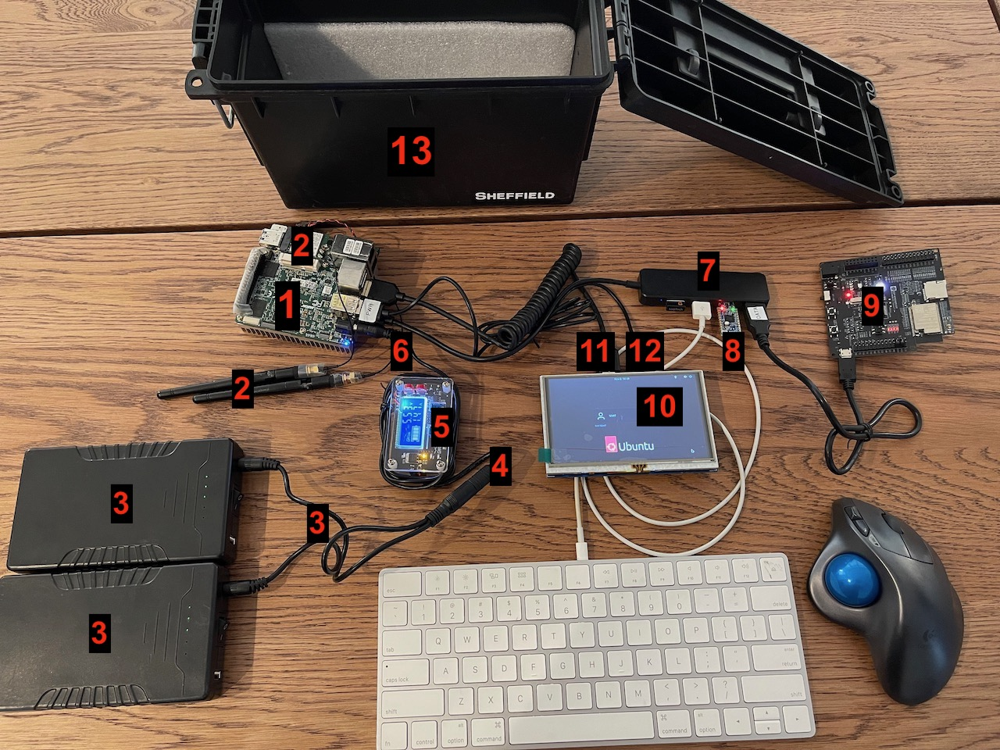
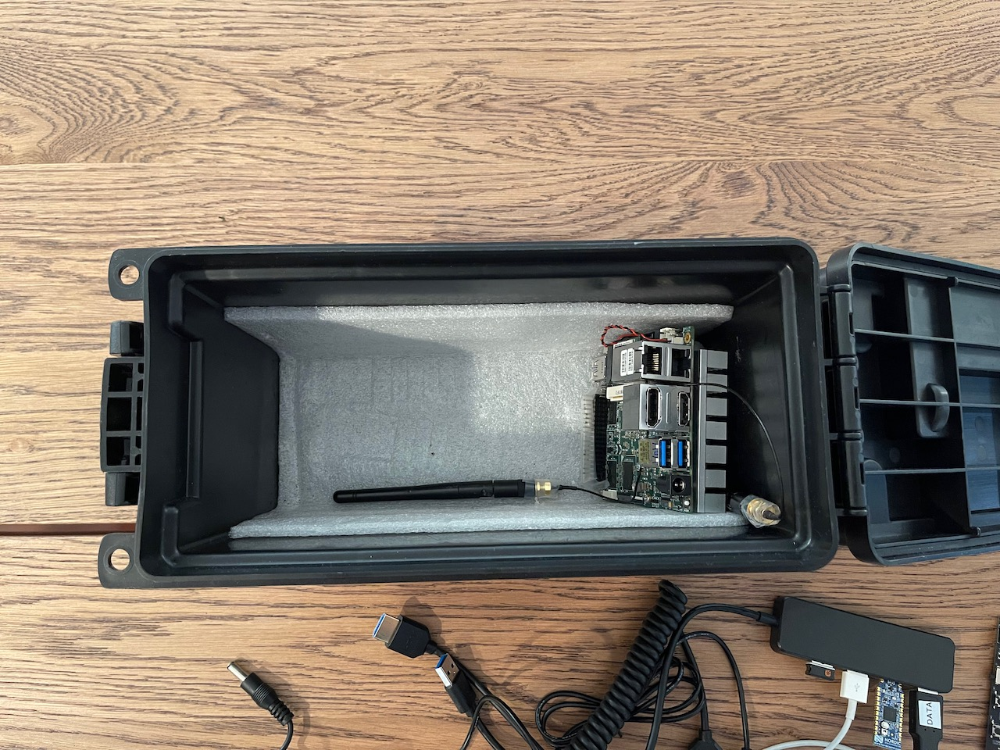
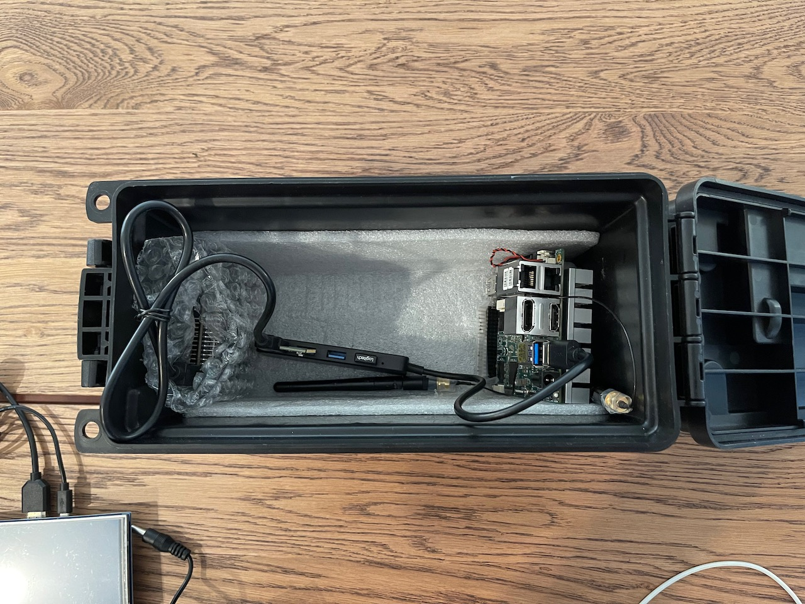
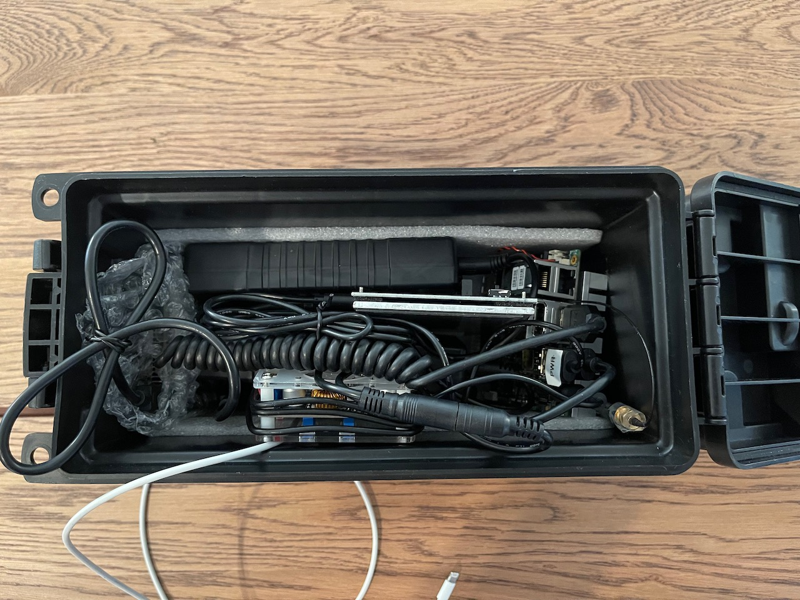
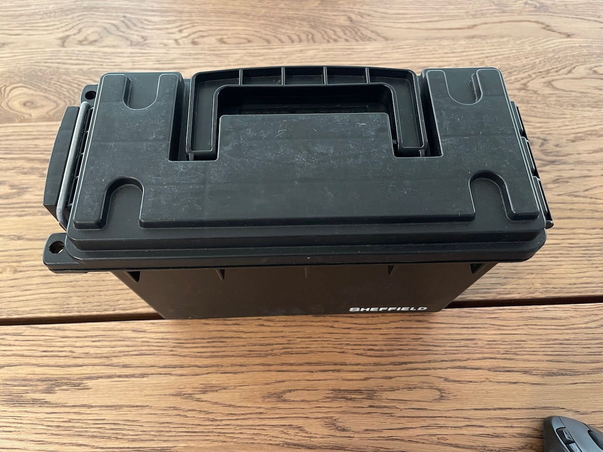
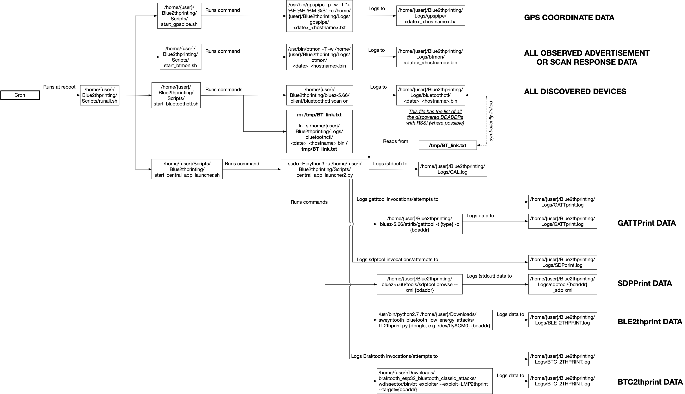

Welcome to Xeno's basic Blue2thprinting setup! It's cheap(ish, other than the small form factor PC) and *good enough* to get started!

# Disclaimer!

The code in this repository is ***researchware***. That means **its purpose is primarily to prove that the results from past research are real, and to allow replication of results*** (in this case, the [Blue2thprinting](https://darkmentor.com/publication/2023-11-hardweario/) talk.) This code is not meant to be used as a production tool, nor is it optimized for performance, ease of use, or anything else. It is only meant to be used by researchers looking to replicate, or expand, on this work.

# Assumed Hardware
(If you do not have any of the below, you will need to purchase.)

* Keyboard
* Mouse
* Monitor with HDMI input (or DVI input and an HDMI adapter. Note: Raspberry Pis have not worked with all monitors / adapter configurations for me.)


# Recommended Hardware

Note: the below hardware purchase links are Amazon affiliate links that support the [OpenSecurityTraining2](https://ost2.fyi) nonprofit.

---
**Computer**

A small form-factor x86-based PC (because currently Sweyntooth and Braktooth are only available as x86-64 Linux binaries.) You can use a laptop if you want, but I wanted to create a device I could place in a weather-proof container and lock up somewhere and sniff without fear of it being stolen, so this build is based around that assumed form factor.

* 1x - Up Squared (aka UP^2) [Intel Atom® x7-E3950 SKU](https://up-shop.org/default/up-squared-series.html) - \$289 + \$13.99 power supply + \$29.99 "M.2 2230 WiFi kit (RE-WFKIT-9260NVP)"
* * I used this because I had one laying around because it's a decent test platform if you're interested in using Positive Technologies' [Intel ME Exploit]() (they're still selling permanently vulnerable boards! :D)
* * Note: Unfortunately this cannot run off a simple USB battery pack. You will need to buy a higher voltage (e.g. 12V) battery and a voltage converter to decrease to ~5.5V.

* 2x - [12V battery pack](https://amzn.to/3tqAj34) - ~\$40/unit

* 1x - [Voltage converter](https://amzn.to/3tkTew4) - ~\$14/unit

* 1x - [Plugs for voltage converter input](https://amzn.to/3RW5AoS) - ~\$4/unit

* 1x - [Plugs for voltage converter output](https://amzn.to/45wmFsu) - \$7/unit
* * You then need to wire it as 12V battery -> in-plugs -> converter -> out-plugs -> UP^2

---
**Custom packet sending hardware (for Braktooth/Sweyntooth)**

For Braktooth - [ESP-WROVER-KIT](https://www.mouser.com/ProductDetail/Espressif-Systems/ESP-WROVER-KIT-VE?qs=KUoIvG%2F9Ilbci6DcltJYaA%3D%3D&mgh=1&gclid=EAIaIQobChMI1OOewJvugQMVik9HAR0FxgvkEAQYASABEgJ01PD_BwE) - ~\$40/unit

For Sweyntooth - [nRF52840 USB dongle](https://www.mouser.com/ProductDetail/Nordic-Semiconductor/nRF52840-Dongle?qs=gTYE2QTfZfTbdrOaMHWEZg%3D%3D) - ~\$10/unit

---
**Accessories**

* 1x - [Non-separate-power USB-A hub](https://amzn.to/3qHCkXw) - ~$8/unit
* * Necessary because there's not enough USB ports for everything you need to connect

* 1x - [HDMI-mini male to HDMI female adapter](https://amzn.to/44javCF) - ~$3.50/unit

* 1x - [USB-A GPS receiver](https://amzn.to/44srqCJ) - ~$19/unit
* * Not necessary if you're only going to place sniffers at a single known location. Necessary if you're going to wander around and want to know where something was observed.

---
**Outdoor deployment equipment**

The following are only required if you'll be placing the devices into an outdoor environment for days at a time:

* 1x - [Lockable water-proof outdoor box](https://amzn.to/3OHsSeO) - ~$9/unit

* 1x - [Keyed Padlock](https://amzn.to/3P95PuM) - ~$10/unit

* 1x - [Flexible bike lock](https://amzn.to/3YOu7xf) - ~$9/unit
* * These [aren't particularly secure](https://www.youtube.com/shorts/dA9OsRal_L8), and indeed I forgot my combo at one point and had to pick my own. But they're just there to stop hobos and randos from walking off with your stuff ;).

---
Nice to have:

* 1x - [5" Mini screen](https://amzn.to/3QtlJj1) - ~$39/unit
* * If you are using the device for mobile sniffing, it's desirable to know if it's actually continuing to capture data, or whether it's crashed. You won't be able to tell that without a screen

* 1x - [Short & flexible HDMI cable](https://www.amazon.com/gp/product/B0B5TDFVVW/ref=ppx_yo_dt_b_search_asin_title?ie=UTF8&th=1) for above mini-screen - ~$14/unit

* USB micro male to USB A male cable (to power the mini-screen) -

---

# Physical hardware setup

**If you bought & set up everything correctly, your setup should look like this**


* Note: This is without the GPS USB connected (for deployment in a fixed location).
* 1 = "UP^2" above
* 2 = "M.2 2230 WiFi kit" above
* 3 = "12V battery pack" above (note, it actually comes with that splitter, for charging and using at the same time, but I use the splitter to connect 2 batteries at once for longer runtime.)
* 4 = "Plugs for voltage converter input" above
* 5 = "Voltage converter" above
* 6 = "Plugs for voltage converter output" above
* 7 = "Non-separate-power USB-A hub" above
* 8 = "nRF52840 USB dongle" above
* 9 = "ESP-WROVER-KIT" above (with USB micro male to USB A male cable (needs data transport))
* 10 = "5" Mini screen" above
* 11 = "Short & flexible HDMI cable" above
* 12 = "USB micro male to USB A male cable" (only needs power transport) above
* 13 = "Lockable water-proof outdoor box" above

**Example of how I install the equipment in the box:**

⬆️ Step 1: I put some foam in to padd some components:


⬆️ Step 2: I place the UP^2 to one side, with the heat-sink facing outward, and one antenna oriented vertically and one horizontally (superstition!) Note, the metal on the antennas is wrapped in tape to avoid it touching any other component's pins.


⬆️ Step 3: I connect the USB hub to the UP^2. The USB hub has the Nordic USB dongle and wireless mouse dongle plugged in, as well as the ESP-WROVER-KIT data cable. I place the ESP-WROVER-KIT at the opposite side of the box, wrapped in something non-conductive (e.g. bubble wrap in this case), so that its exposed pins don't touch any other components.


⬆️ Step 4: I connect the keyboard USB cable to the USB hub. And I insert the two 12V batteries, connected via their included splitter. I place the batteries so that there is a gap inbetween them, where the screen will be slotted when not in use later.


⬆️ Step 5: I connect the 5" screen via HDMI and USB. The screen has a switch to power it off when not in use, which should be flipped to save battery life.


⬆️ Step 6: I connect the assembled 12V -> 5.5V power converter, connecting one end to the 12V batteries' splitter, and one end to the power of the UP^2.


⬆️ Step 7: At this point the USB keyboard cord can be coiled in the box, and the box powered on, for portable sniffing or placement at a location for static sniffing.


⬆️ Step 8: The box can then be opened and the keyboard connected and powered on, the mouse powered on, and screen removed and powered on and it can be interacted with like any other Linux-based PC. The power converted can be disconnected from the splitter connected to the 12V batteries, and a charger connected instead, to charge the 12V batteries once they're dead. Or the device can simply be connected to the UP^2's wall power adapter when experimenting and not needing to run off battery.

* Note: In principle it's desirable to use a wired mouse/keyboard, *not* wireless ones, to not introduce any additional 2.4GHz interference. On the other hand, I find that using a normal wired mouse is inconvenient if I'm driving around and want to look at something, because there's no decent mousing surfaces. Hence why I use a wireless trackball. (I should probably get a wired trackball.)

---

# Recommended Software

Install *Ubuntu 22.04* on the UP^2.

# OS Setup & Configuration

## ***All code assumes that you've checked out this repository to your home directory as `~/Blue2thprinting`.***

### Run the setup helper script

This previously was a bunch of manual commands. Now instead just run the below:

```
cd ~/Blue2thprinting
sudo ./setup_capture_helper_debian-based.sh
```

And there's comments in that script if you want to see what's being done and why.

If you stopped right now and rebooted, you'd have a functional automatic-capture setup that is equivalent to the [naiveBTsniffing](https://github.com/darkmentorllc/naiveBTsniffing) repository! But keep going to set up Braktooth and Sweyntooth to get the full power of Blue2thprinting!

### Setup Braktooth

Place the Braktooth code in the location assumed by `central_app_launcher2.py`:

```
cd ~/Downloads
git clone https://github.com/Matheus-Garbelini/braktooth_esp32_bluetooth_classic_attacks.git
```

You are required to setup Braktooth to work **[per the "Installation instructions" in the Braktooth repository](https://github.com/Matheus-Garbelini/braktooth_esp32_bluetooth_classic_attacks)**.

**Known issues with instructions:**

**1)** The `wdissector.tar.zst` in the root of the folder isn't the full 300MB+ file; it instead needs to be grabbed from the [artifact release](https://github.com/Matheus-Garbelini/braktooth_esp32_bluetooth_classic_attacks/releases/download/v1.0.1/release.zip).

**2)** Because the instructions are for Ubuntu 18.04, on Ubuntu 22.04 you will need to issue the following commands to install the missing "libssl.so.1.1" and "libcrypto.so.1.1" shared libraries, to make the pre-compiled `braktooth_esp32_bluetooth_classic_attacks/wdissector/bin/bt_exploiter` binary work:

```
wget http://archive.ubuntu.com/ubuntu/pool/main/o/openssl/libssl1.1_1.1.0g-2ubuntu4_amd64.deb
sudo dpkg -i libssl1.1_1.1.0g-2ubuntu4_amd64.deb
```

**3)** Modify the following file to make it so that the `LMP2thprint.cpp` will compile properly.

In `~/Downloads/braktooth_esp32_bluetooth_classic_attacks/wdissector$ nano src/ModulesInclude.hpp`, replace all the instances of "extern", with "static", as shown below.

Replace

```
extern const char *module_name();
// Setup
extern int setup(void *p);
// TX Pre
extern int tx_pre_dissection(uint8_t *pkt_buf, int pkt_length, void *p);
// TX Ppost
extern int tx_post_dissection(uint8_t *pkt_buf, int pkt_length, void *p);
// RX Pre
extern int rx_pre_dissection(uint8_t *pkt_buf, int pkt_length, void *p);
// RX Post
extern int rx_post_dissection(uint8_t *pkt_buf, int pkt_length, void *p);
```

with

```
static const char *module_name();
// Setup
static int setup(void *p);
// TX Pre
static int tx_pre_dissection(uint8_t *pkt_buf, int pkt_length, void *p);
// TX Ppost
static int tx_post_dissection(uint8_t *pkt_buf, int pkt_length, void *p);
// RX Pre
static int rx_pre_dissection(uint8_t *pkt_buf, int pkt_length, void *p);
// RX Post
static int rx_post_dissection(uint8_t *pkt_buf, int pkt_length, void *p);
```

**Manually confirm that Braktooth is working before attempting to run it from within central_app_launcher2.py:**

If you have a username other than 'pi', update `~/Blue2thprinting/Braktooth_module/LMP2thprint.cpp` to correct the path in the `BTC2TH_LOG_PATH` variable.

```
cd ~/Downloads/braktooth_esp32_bluetooth_classic_attacks/wdissector
cp ~/Blue2thprinting/Braktooth_module/LMP2thprint.cpp ~/Downloads/braktooth_esp32_bluetooth_classic_attacks/wdissector/modules/exploits/bluetooth/
sudo ~/Downloads/braktooth_esp32_bluetooth_classic_attacks/wdissector/bin/bt_exploiter --exploit=LMP2thprint --target=AA:BB:CC:11:22:33
```

Of course, replace `AA:BB:CC:11:22:33` with the BTC BDADDR you want to target.

Once you have confirmed this works, you should set `btc_2thprint_enabled = True` in `~/central_app_launcher2.py`.

### Setup Sweyntooth

Place the Sweyntooth code in the location assumed by `central_app_launcher2.py`:

```
cp -r ~/Blue2thprinting/sweyntooth_bluetooth_low_energy_attacks ~/Downloads/sweyntooth_bluetooth_low_energy_attacks
```

You are required to setup Sweyntooth to work **[by following the instructions in the Sweyntooth repository](https://github.com/Matheus-Garbelini/sweyntooth_bluetooth_low_energy_attacks)**.

Once you get the custom firmware onto the Nordic device, the theoretical minimal instructions to make this local copy of Sweyntooth work are as follows:

```
cd ~/Downloads/sweyntooth_bluetooth_low_energy_attacks
sudo apt-get install python2.7
wget -c https://bootstrap.pypa.io/pip/2.7/get-pip.py
# need to install the Python 2.7 requirements in /root (sudo) because the Sweyntooth script will run with sudo
sudo python2.7 get-pip.py
# In case it warns you that it installed pip2.7 in a location that's not in your path, e.g. /home/user/.local/bin/, add that location to your PATH with "export PATH=$PATH:/home/user/.local/bin/"
sudo pip2.7 install -r requirements.txt
```

**Manually confirm that Sweyntooth is working before attempting to run it from within central_app_launcher2.py:**

If you're using a username other than "pi", edit the `BLE2TH_LOG_PATH` variable in `~/Downloads/sweyntooth_bluetooth_low_energy_attacks/LL2thprint.py`.

```
cd ~/Downloads/sweyntooth_bluetooth_low_energy_attacks
sudo -E python2.7 LL2thprint.py /dev/ttyACM0 AA:BB:CC:11:22:33
```

Of course, replace `AA:BB:CC:11:22:33` with the BLE BDADDR you want to target, and `/dev/ttyACM0` with the correct TTY device (but that should be it by default if you don't e.g. have the GPS plugged in before it.)

Once you have confirmed this works, you should set `ble_2thprint_enabled = True` in `~/central_app_launcher2.py`.

# Script interactions & data flow

Which scripts launch which other scripts, and what logs what data to where is captured in the below diagram (click for full size image.)



# Capture Scripts Setup

### Setup automatic script execution at boot:

The previous `setup_capture_helper_debian-based.sh` should have already configured your system to automatically run data capture at reboot. So now reboot with `sudo reboot`.

After the system comes back up, run:
`~/Blue2thprinting/Scripts/check.sh`
If you are too quick, you will see things like `start_btmon.sh` and `start_bluetoothctl.sh`.
But after their sleep timers have expired, they will transition to things like:

```
root        1952  0.0  0.0   3636  1008 ?        S    18:02   0:00 /usr/bin/btmon -T -w /home/user/Blue2thprinting/Logs/btmon/2024-06-13-18-01-39_VM.bin
user        2034  0.0  0.0   9040   648 pts/0    S+   18:03   0:00 grep btmon
user        2036  0.0  0.0   9040   720 pts/0    S+   18:03   0:00 grep bluetoothctl
root         783  0.0  0.0   9500  3312 ?        S    18:01   0:00 /bin/bash /home/user/Blue2thprinting/Scripts/start_central_app_launcher.sh
root        1977  0.0  0.1  11924  4624 ?        S    18:02   0:00 sudo -E python3 -u /home/user/Blue2thprinting/Scripts/central_app_launcher2.py
root        1979 97.9  0.3 168332 11936 ?        Sl   18:02   0:44 python3 -u /home/user/Blue2thprinting/Scripts/central_app_launcher2.py
user        2038  0.0  0.0   9040   720 pts/0    S+   18:03   0:00 grep central_app
```
From now on, whenever you reboot, the data collection will begin automatically.

You can cancel collection by running: `sudo ~/Blue2thprinting/Scripts/killall.sh`.

If you want to manually restart the collection without a reboot, you can run: `sudo ./runall.sh` from the Scripts folder.

# Analysis Scripts Usage

After you have sniffed some traffic, you will have files in ~/Blue2thprinting/Logs/btmon/ and ~/Blue2thprinting/Logs/gpspipe/, that should be named the same as each other (timestamp followed by hostname) except that GPS files end in .txt and btmon in .bin.

**Note:** Because data parsing and database lookups can be CPU/IO intensive, it is generally recommended to *not* perform data import or analysis on the capture device (the UP^2 in this case.) Rather, it is recommended to copy all data off to a separate, faster, analysis system, and perform the subsequent steps there.

### dump\_names\_specific.sh

Assume we have the following files:

```
user@VM:/home/user/Blue2thprinting/# ls Logs/btmon/
2023-08-24-01-04-59_pi0-2.bin  2023-08-24-01-11-38_pi0-2.bin
```

The named bluetooth devices found in multiple files can be dumped to stdout as follows:

```
./dump_names_specific.sh 2023-08-24-01-04-59_pi0-2.bin 2023-08-24-01-11-38_pi0-2.bin
Processing  /home/user/Blue2thprinting/Logs/btmon/2023-08-24-01-04-59_pi0-2.bin
btmon -T -r /home/user/Blue2thprinting/Logs/btmon/2023-08-24-01-04-59_pi0-2.bin.bin | grep -e "Name (.*):" | sort | uniq
Processing  /home/user/Blue2thprinting/Logs/btmon/2023-08-24-01-11-38_pi0-2.bin
btmon -T -r /home/user/Blue2thprinting/Logs/btmon/2023-08-24-01-11-38_pi0-2.bin.bin | grep -e "Name (.*):" | sort | uniq
All found names:
        Name (complete): This_is-not_real
        Name (complete): Neither is this😎
        Name (complete): BecauseWiGLEWouldTellYouWhereILive:P
```
from within the Scripts folder.

*Note:* The accepted name format is just the filename, not the full path.

## Import data into MySQL

**Note:** Because data parsing and database lookups can be CPU/IO intensive, it is generally recommended to *not* perform data import or analysis on the capture device (the UP^2 in this case.) Rather, it is recommended to copy all data off to a separate, faster, analysis system, and perform the subsequent steps there.

### One time setup

**Linux Software Setup**: You should already have the necessary MySQL (MariaDB) database and tshark tools installed from the above apt-get commands.

```
cd ~/Blue2thprinting
sudo ./setup_analysis_helper_debian-based.sh
```

**macOS Software Setup**: macOS cannot be used for collection, but it can be used for analysis of files collected on other platforms. You must first [install HomeBrew](https://brew.sh/), and then run `brew install mysql` and `brew install wireshark` (for the `tshark` CLI version). (If for some reason neither tshark nor wireshark are found in your PATH, look in / add from /usr/local/Cellar/wireshark/). Then also edit `/usr/local/etc/my.cnf` and add `secure_file_priv = /tmp` at the end of the file, and then start the mysql server with `/usr/local/opt/mysql/bin/mysqld_safe --datadir=/usr/local/var/mysql`.

Then run

```
cd ~/Blue2thprinting
sudo ./setup_analysis_helper_macOS.sh
```

The above `setup_analysis_helper*.sh` scripts should be re-run if you ever do a "git pull" in the `Blue2thprinting/public` directory, which contains the Bluetooth Assigned Numbers information, to get updated assigned vendor UUID16s.

### Importing data from btmon .bin HCI log files

**Import ExampleData:**

```
cd ~/Blue2thprinting/Analysis
./parse_HCI_2db.sh ../ExampleData/2023-10-06-08-52-20_up-apl01.bin
```

You should see a variety of outputs such as "tsharking", and "mysql import". You can safely ignore any tshark warnings about the file being "cut short in the middle of a packet".

**To confirm that some data was successfully imported, you can issue:**

```
mysql -u user -pa -D bt -e "SELECT * FROM LE_bdaddr_to_name LIMIT 10;"
```

This should show some of the same sort of device name data that you could see by the above `./dump_names_specific.sh` command.

**Import your own data:**

Eventually once you have many files from your own collection that you want to process in bulk, you will want to pass each file to `parse_HCI_2db.sh` sequentially. For that you can issue a command like:

`time find ~/Blue2thprinting/Logs/btmon/2024-06* -type f -name "*.bin" | xargs -n 1 -I {} bash -c " ./parse_HCI_2db.sh {}"`

### Importing GATT data from GATTprint.log

Both `central_app_launcher2.py` and `gatttool` log information about attempted and successful GATTprinting to the file `/home/user/Blue2thprinting/Logs/GATTprint.log` (or alt user home directory if you reconfigured it). To import this data into the database, run the following:

```
cd ~/Blue2thprinting/Analysis/
cat ~/Blue2thprinting/Logs/GATTprint*.log | sort | uniq > GATTprint_dedup.log
python3 ./parse_GATTPRINT_2db.py
```

The above `cat` step is useful both to speed up the parsing of a single host's data (if it queried the same host multiple times), but also to combine data from multiple hosts, and avoid unnecessary duplicative mysql imports.

**To confirm that some data was successfully imported, you can issue:**

```
mysql -u user -pa -D bt -e "SELECT * FROM GATT_characteristics LIMIT 10;"
```

### Importing BLE LL data from BLE_2THPRINT.log

Both `central_all_launcher2.py` and my `LL2thprint.py` Sweyntooth module log information about attempted and successful LL2thprint to the file `/home/user/Blue2thprinting/Logs/BLE_2THPRINT.log` (or alt user home directory if you reconfigured it). To import this data into the database, run the following:

```
cd ~/Blue2thprinting/Analysis/
cat ~/Blue2thprinting/Logs/BLE_2THPRINT*.log | sort | uniq > BLE_2THPRINT_dedup.log
python3 ./parse_BLE_2THPRINT_2db.py
```

The above `cat` step is useful both to speed up the parsing of a single host's data (if it queried the same host multiple times), but also to combine data from multiple hosts, and avoid unnecessary duplicative mysql imports.

**To confirm that some data was successfully imported, you can issue:**

```
mysql -u user -pa -D bt -e "SELECT * FROM LL_VERSION_IND LIMIT 10;"
```

### Importing BTC LMP data from BTC_2THPRINT.log

Both `central_all_launcher2.py` and my `LMP2thprint.cpp` Braktooth module log information about attempted and successful LL2thprint to the file `/home/user/Blue2thprinting/Logs/BTC_2THPRINT.log` (or alt user home directory if you reconfigured it). To import this data into the database, run the following:

```

cd ~/Blue2thprinting/Analysis/
python3 ./parse_BTC_2THPRINT_2db.py
```

Unfortunately no deduplication of data is possible currently due to the fact that I don't know how to obtain the BDADDR from within Braktooth and add it to every log line. If you know how, LMK! Because currently this is dependent on `central_all_launcher2.py` prepending log entries to let the parsing know what BDADDR the subsequent data is for.

**To confirm that some data was successfully imported, you can issue:**

```
mysql -u user -pa -D bt -e "SELECT * FROM LMP_VERSION_RES LIMIT 10;"
```

## Inspecting data with TellMeEverything.py

`cd ~/Blue2thprinting/Analysis`

You will need Python3 installed, and you may need to change the path to the python3 interpreter at the beginning of the file. You will also need to do `pip3 install mysql-connector-python`, `pip3 install pyyaml` if you have not already.

Issue `python3 ./TellMeEverything.py --help` for the latest usage.

**If you get an error like "public/path/something can't be found"**, make sure your `~/Blue2thprinting/Analysis/public` folder is not empty. If it is empty, that implies you didn't check out the Bluetooth assigned numbers sub-module at git repository clone time. This can be corrected by issuing `git submodule update --init --recursive`.

**Printing information for a specific BDADDR**:

`python3 ./TellMeEverything.py --bdaddr 4c:e6:c0:21:39:a6`

**Printing information for BDADDRs that have a name that matches a given regex**:

`python3 ./TellMeEverything.py --nameregex "^Flipper"`

The regex is used as a MySQL "REGEXP" statement, and thus must be valid MySQL regex syntax.

**Printing information for BDADDRs that have some data element that is associated with a company name that matches a given regex**:

`python3 ./TellMeEverything.py --companyregex "^Qualcomm"`

The regex is checked against associations with the BDADDR IEEE OUI, UUID16s, and BT/BLE CompanyID fields from link layer version information.

**Printing information for BDADDRs that have a UUID128 that matches a given regex**:

`python3 ./TellMeEverything.py --UUID128regex "02030302"`

**Printing information for BDADDRs that have Manufacturer Specific Data that matches a given regex**:

`python3 ./TellMeEverything.py --MSDregex "008fc3d5"`


### GPS

I originally added support for GPS logging of where devices were seen, before I learned that [WiGLE.net](https://WiGLE.net) had support for crowdsourced Bluetooth logging. These days I tend to not use my GPS dongle, and instead I just run a junk Pixel phone with WiGLE and consider its capture good enough. (Also the phone's GPS seemed to generally be more reliable than the USB GPS dongle.)

Therefore I have moved discussion of the GPS setup to a [separate page](GPS.md) to simplify the default system setup. If you'd like to re-enable this capability, follow the instructions on that page.

Copyright(c) © Dark Mentor LLC 2023-2024
