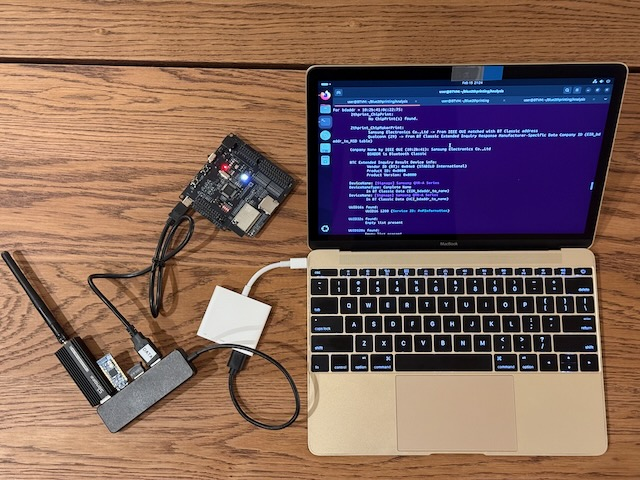

# Disclaimer!

The code in this repository is ***researchware***. That means **its purpose is primarily to prove that the results of [past research](https://darkmentor.com/publication/2023-11-hardweario/) are real, and to allow replication of results**. This code is not yet meant to be used as a production tool, nor is it optimized for performance. It is only meant to be used by *researchers* looking to replicate, or expand, on this work.

# OST2 Class Now Available!

The class ["Bluetooth 2222: Bluetooth reconnaissance with Blue2thprinting"](https://ost2.fyi/BT2222) is now available on [OpenSecurityTraining2](https://ost2.fyi/)!

This class takes on average about 8.5h to complete, and is by far the best way to learn how to use this software. It provides you with a preconfigured VM and walks you through the 30+ Bluetooth data types which are exposed for your analysis. Afterwards you can come back and load Blue2thprinting on to whichever of the physical setups below works best for you.

# Hardware Setup Guides

You should pick one of the below targets which best matches your goals.

| Image | Setup instructions  | 
|-----|-------------|
|  | [Any random x86-based laptop](./docs/laptopHW.md) 
 Best for convenience. |
|  | [tiny2th](./docs/minHW.md) 
 Best for small size. |
|  | [Blue2thprinting Pro Max Extreme Edition!](./docs/maxHW.md) 
 Best for capabilities. |

---

# Software Setup & Configuration

## 1️⃣ Try out [analysis](./docs/Analysis.md) on [BTIDALPOOL](./docs/BTIDALPOOL.md) data first

## 2️⃣ Setup [capture](./docs/Capture.md) second

## 3️⃣ [Import your own captured data](./docs/Import.md) third

Copyright(c) © Dark Mentor LLC 2023-2025
