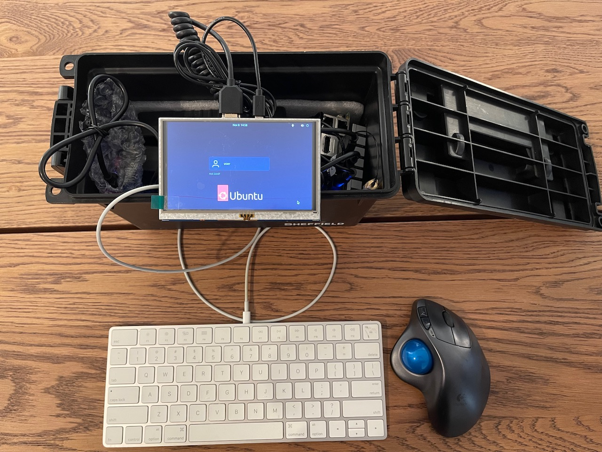

# Disclaimer!

The code in this repository is ***researchware***. That means **its purpose is primarily to prove that the results of [past research](https://darkmentor.com/publication/2023-11-hardweario/) are real, and to allow replication of results**. This code is not yet meant to be used as a production tool, nor is it optimized for performance. It is only meant to be used by *researchers* looking to replicate, or expand, on this work.

# Hardware Setup Guides

You should pick one of the below targets which best matches your goals.

| Image | Setup instructions  | 
|-----|-------------|
| | [Any random laptop](./docs/laptopHW.md) 
 Best for convenience. |
| | [tiny2th](./docs/minHW.md) 
 Best for small size. |
|  | [Blue2thprinting Pro Max Extreme Edition!](./docs/maxHW.md) 
 Best for capabilities. |

---

# Software Setup & Configuration

## Setup [analysis](./docs/Analysis.md) first

## Setup [capture](./docs/Capture.md) second

