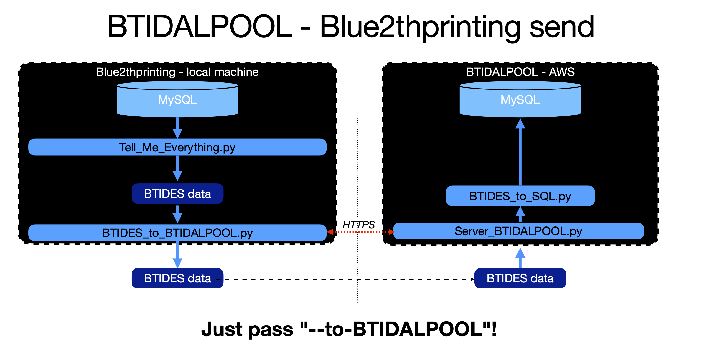

# BTIDALPOOL

The BTIDALPOOL is the server is where we *pool* our [BTIDES](https://github.com/darkmentorllc/BTIDES_Schema) data! It allows for crowdsourced upload/download of Bluetooth data in BTIDES format.

The current address is:  
 - `https://btidalpool.ddns.net:7653` - For Google OAuth  
 - `https://btidalpool.ddns.net:3567` - For [BTIDES](https://github.com/darkmentorllc/BTIDES_Schema) upload/download.

## [Terms of Service](https://btidalpool.ddns.net:7653/tos)

## [Privacy Policy](https://btidalpool.ddns.net:7653/privacy)

## 1st party access

BTIDALPOOL can be used from Blue2thprinting tools by adding CLI arguments such as `--to-BTIDALPOOL` to upload, or `--query-BTIDALPOOL` to download.

**Uploaders:**  
[`Tell_Me_Everything.py`]()  
[`BTIDES_to_BTIDALPOOL.py`]()  
[`PCAP_to_BTIDES.py`]()  
[`HCI_to_BTIDES.py`]()  
[`Import_all_HCI_and_PCAP.py`]()  

**Downloaders:**  
[`Tell_Me_Everything.py`]()  
[`BTIDALPOOL_to_BTIDES.py`]()  

## 3rd party access

3rd party clients wishing to upload/download data, can either use [`BTIDES_to_BTIDALPOOL.py`]() or read its code (in particular `send_btides_to_btidalpool()` or `Server_BTIDALPOOL.py`'s `do_POST()`) to see the minimal JSON format wrapping the BTIDES data with upload/download commands.

## Rate limits

The following limits are currently in effect:  
 * Maximum number of connections per account per day: 100  
 * Maximum simultaneous connections per account: 10  
 * Maximum number of records returned per query: 100  
 * Maximum BTIDES file upload size: 10MB  

If you'd like to bypass these limits, you can email btidalpool at gmail to request Trusted Contributor status. This status is granted to researchers who provide a significant contribution of data to the BTIDALPOOL server.

