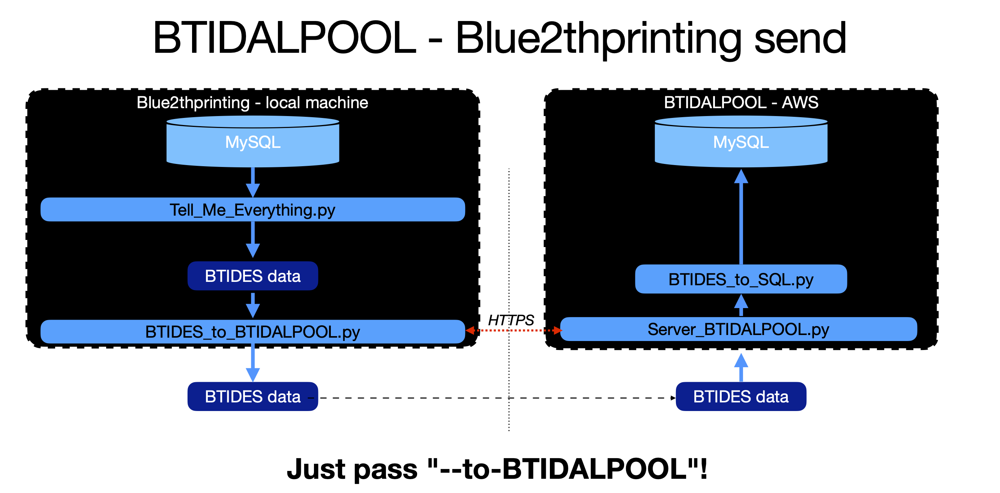

# BTIDALPOOL

The BTIDALPOOL is the server is where we *pool* our [BTIDES](https://github.com/darkmentorllc/BTIDES_Schema) data! It allows for crowdsourced upload/download of Bluetooth data in BTIDES format.

The current address is:
 - `https://btidalpool.ddns.net:7653` - For Google OAuth
 - `https://btidalpool.ddns.net:3567` - For [BTIDES](https://github.com/darkmentorllc/BTIDES_Schema) upload/download.

## [Terms of Service](https://btidalpool.ddns.net:7653/tos)

## [Privacy Policy](https://btidalpool.ddns.net:7653/privacy)

## 1st party access

BTIDALPOOL can be used from Blue2thprinting tools by adding CLI arguments such as `--to-BTIDALPOOL` to upload, or `--query-BTIDALPOOL` to download.

**Uploaders:**
[`Tell_Me_Everything.py`]()
[`BTIDES_to_BTIDALPOOL.py`]()
[`PCAP_to_BTIDES.py`]()
[`HCI_to_BTIDES.py`]()

**Downloaders:**
[`Tell_Me_Everything.py`]()
[`BTIDALPOOL_to_BTIDES.py`]()

## 3rd party access

3rd party clients wishing to upload/download data have two options that currently run side by side:

* **Original Python implementation** — [`Analysis/BTIDES_to_BTIDALPOOL.py`](../Analysis/BTIDES_to_BTIDALPOOL.py) (upload) and [`Analysis/BTIDALPOOL_to_BTIDES.py`](../Analysis/BTIDALPOOL_to_BTIDES.py) (download). Reading `send_btides_to_btidalpool()` in the upload script (or `do_POST()` in [`Analysis/Server_BTIDALPOOL.py`](../Analysis/Server_BTIDALPOOL.py)) shows the legacy raw-JSON request/response shape.
* **Rust reimplementation** — the `btidalpool-client` binary built from [`BTIDALPOOL/`](../BTIDALPOOL/), or the equivalent Python shims at [`BTIDALPOOL/python/BTIDES_to_BTIDALPOOL.py`](../BTIDALPOOL/python/BTIDES_to_BTIDALPOOL.py) and [`BTIDALPOOL/python/BTIDALPOOL_to_BTIDES.py`](../BTIDALPOOL/python/BTIDALPOOL_to_BTIDES.py) (same function signatures as the originals, but shell out to the Rust binary). The Rust wire format (CBOR-encoded envelope inside a zstd-compressed frame, with explicit zip-bomb guards) is defined once in [`BTIDALPOOL/crates/btidalpool-proto/`](../BTIDALPOOL/crates/btidalpool-proto/) and is the same on client and server. See [`BTIDALPOOL/README.md`](../BTIDALPOOL/README.md) for the protocol details.

## Rate limits

The following limits are currently in effect:
 * Maximum number of connections per account per day: 100
 * Maximum simultaneous connections per account: 10
 * Maximum number of records returned per query: 100
 * Maximum BTIDES file upload size: 10MB

If you'd like to bypass these limits, you can email btidalpool at gmail to request Trusted Contributor status. This status is granted to researchers who provide a significant contribution of data to the BTIDALPOOL server.

Copyright(c) © Dark Mentor LLC 2023-2026
