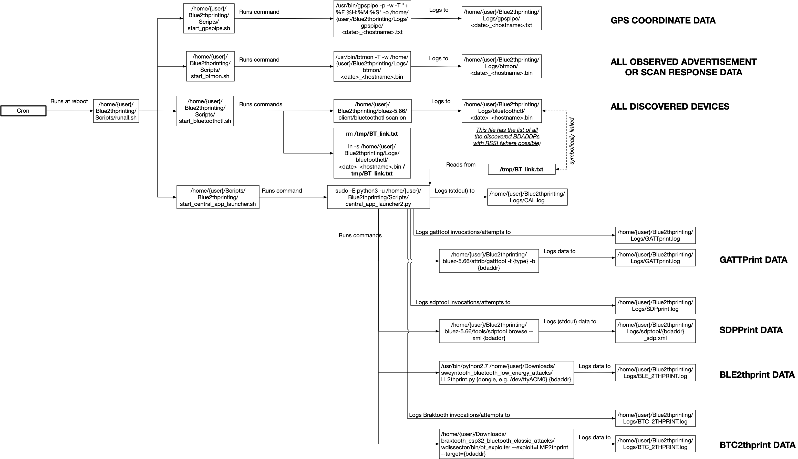

# Supported base OSes

* Laptop: Install *Ubuntu 24.04* into a **VMware** VM.
* Mini-PC: Install *Ubuntu 24.04* into host OS.
* Raspberry Pi Zero W: Install Raspbian ***Buster*** using the [Raspberry Pi Imager](https://www.raspberrypi.com/software/).

# OS Setup & Configuration

## ***All code assumes that you've checked out this repository to your home directory as `~/Blue2thprinting`.***

## Run the setup helper script

This previously was a bunch of manual commands. Now instead just run the below:

```
cd ~/Blue2thprinting
sudo ./setup_capture_helper_debian-based.sh
```

And there's comments in that script if you want to see what's being done and why.

If you stopped right now and rebooted, you'd have a functional automatic-capture setup that is equivalent to the [naiveBTsniffing](https://github.com/darkmentorllc/naiveBTsniffing) repository! But keep going to set up Braktooth to get the full power of Blue2thprinting!

Run `sudo crontab -e` to review your crontab and confirm you only have a single instance of the `@reboot /home/user/Blue2thprinting/Scripts/runall.sh` command in it. If you ran the `setup_capture_helper_debian-based.sh` file multiple times, remove any extra instances of the `runall.sh` command.

## Setup Braktooth

Place the Braktooth code in the location assumed by `central_app_launcher2.py`:

```
cd ~/Downloads
git clone https://github.com/Matheus-Garbelini/braktooth_esp32_bluetooth_classic_attacks.git
```

You are required to setup Braktooth to work **[per the "Installation instructions" in the Braktooth repository](https://github.com/Matheus-Garbelini/braktooth_esp32_bluetooth_classic_attacks)**.

**Known issues with Braktooth's given instructions:**

**1)** The `wdissector.tar.zst` in the root of the folder isn't the full 300MB+ file; it instead needs to be grabbed from the [artifact release](https://github.com/Matheus-Garbelini/braktooth_esp32_bluetooth_classic_attacks/releases/download/v1.0.1/release.zip).

**2)** Because the instructions are for Ubuntu 18.04, on Ubuntu 22.04 you will need to issue the following commands to install the missing "libssl.so.1.1" and "libcrypto.so.1.1" shared libraries, to make the pre-compiled `braktooth_esp32_bluetooth_classic_attacks/wdissector/bin/bt_exploiter` binary work:

```
wget http://archive.ubuntu.com/ubuntu/pool/main/o/openssl/libssl1.1_1.1.0g-2ubuntu4_amd64.deb
sudo dpkg -i libssl1.1_1.1.0g-2ubuntu4_amd64.deb
```

**3)** Modify the following file to make it so that the `LMP2thprint.cpp` will compile properly.

In `~/Downloads/braktooth_esp32_bluetooth_classic_attacks/wdissector$ nano src/ModulesInclude.hpp`, replace all the instances of "extern", with "static", as shown below.

Replace

```
extern const char *module_name();
// Setup
extern int setup(void *p);
// TX Pre
extern int tx_pre_dissection(uint8_t *pkt_buf, int pkt_length, void *p);
// TX Ppost
extern int tx_post_dissection(uint8_t *pkt_buf, int pkt_length, void *p);
// RX Pre
extern int rx_pre_dissection(uint8_t *pkt_buf, int pkt_length, void *p);
// RX Post
extern int rx_post_dissection(uint8_t *pkt_buf, int pkt_length, void *p);
```

with

```
static const char *module_name();
// Setup
static int setup(void *p);
// TX Pre
static int tx_pre_dissection(uint8_t *pkt_buf, int pkt_length, void *p);
// TX Ppost
static int tx_post_dissection(uint8_t *pkt_buf, int pkt_length, void *p);
// RX Pre
static int rx_pre_dissection(uint8_t *pkt_buf, int pkt_length, void *p);
// RX Post
static int rx_post_dissection(uint8_t *pkt_buf, int pkt_length, void *p);
```

**Manually confirm that Braktooth is working before attempting to run it from within central_app_launcher2.py:**

If you have a username other than 'pi', update `~/Blue2thprinting/Braktooth_module/LMP2thprint.cpp` to correct the path in the `BTC2TH_LOG_PATH` variable.

```
cd ~/Downloads/braktooth_esp32_bluetooth_classic_attacks/wdissector
cp ~/Blue2thprinting/Braktooth_module/LMP2thprint.cpp ~/Downloads/braktooth_esp32_bluetooth_classic_attacks/wdissector/modules/exploits/bluetooth/
sudo ~/Downloads/braktooth_esp32_bluetooth_classic_attacks/wdissector/bin/bt_exploiter --exploit=LMP2thprint --target=AA:BB:CC:11:22:33
```

Of course, replace `AA:BB:CC:11:22:33` with the BTC BDADDR you want to target.

Once you have confirmed this works, you should set `braktooth_enabled = True` in `~/central_app_launcher2.py`.

# Capture Scripts Setup

### Setup automatic script execution at boot:

The previous `setup_capture_helper_debian-based.sh` should have already configured your system to automatically run data capture at reboot (which you should have confirmed with the `sudo crontab -e` above).

Before rebooting, run `hciconfig` and confirm you see at least one HCI Bluetooth interface (i.e. not empty output). If you don't, make sure you attach your USB Bluetooth dongle (if you don't have built-in Bluetooth passthrough capability from VMware), and attach that USB device to your VM.

Now reboot with `sudo reboot`.

After the system comes back up, run:
`~/Blue2thprinting/Scripts/check.sh`
If you are too quick, you will see things like `start_btmon.sh` and `start_bluetoothctl.sh`.
But after their sleep timers have expired, they will transition to things like:

```
root        1952  0.0  0.0   3636  1008 ?        S    18:02   0:00 /usr/bin/btmon -T -w /home/user/Blue2thprinting/Logs/btmon/2024-06-13-18-01-39_VM.bin
user        2034  0.0  0.0   9040   648 pts/0    S+   18:03   0:00 grep btmon
user        2036  0.0  0.0   9040   720 pts/0    S+   18:03   0:00 grep bluetoothctl
root         783  0.0  0.0   9500  3312 ?        S    18:01   0:00 /bin/bash /home/user/Blue2thprinting/Scripts/start_central_app_launcher.sh
root        1977  0.0  0.1  11924  4624 ?        S    18:02   0:00 sudo -E python3 -u /home/user/Blue2thprinting/Scripts/central_app_launcher2.py
root        1979 97.9  0.3 168332 11936 ?        Sl   18:02   0:44 python3 -u /home/user/Blue2thprinting/Scripts/central_app_launcher2.py
user        2038  0.0  0.0   9040   720 pts/0    S+   18:03   0:00 grep central_app
```
From now on, whenever you reboot, the data collection will begin automatically.

You can cancel collection by running: `sudo ~/Blue2thprinting/Scripts/killall.sh`.

If you want to manually restart the collection without a reboot, you can run: `sudo ./runall.sh` from the Scripts folder.

# Script interactions & data flow

Which scripts launch which other scripts, and what logs what data to where is captured in the below diagram (click for full size image.)



# GPS

I originally added support for GPS logging of where devices were seen, before I learned that [WiGLE.net](https://WiGLE.net) had support for crowdsourced Bluetooth logging. These days I tend to not use my GPS dongle, and instead I just run a junk Pixel phone with WiGLE and consider its capture good enough. (Also the phone's GPS seemed to generally be more reliable than the USB GPS dongle.)

So currently I primarily get GPS data from WiGLE and import it via `~/Blue2thprinting/Analysis/WIGLE_to_BTIDES.py`.

Therefore I have moved discussion of the linux native GPS setup to a [separate page](./GPS.md) to simplify the default system setup. If you'd like to re-enable this capability, follow the instructions on that page.

Copyright(c) © Dark Mentor LLC 2023-2025
