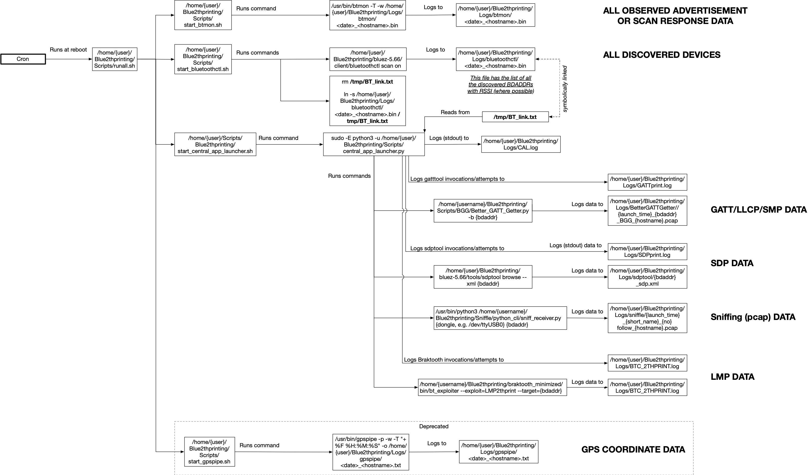

# Supported base OSes

* Laptop: Install *Ubuntu 24.04* into a **VMware** VM.
* Mini-PC: Install *Ubuntu 24.04* into host OS.
* Raspberry Pi Zero W: Install Raspbian ***Buster*** using the [Raspberry Pi Imager](https://www.raspberrypi.com/software/).

# OS Setup & Configuration

## ***All code assumes that you've checked out this repository to your home directory as `~/Blue2thprinting`.***

## Run the setup helper script

This previously was a bunch of manual commands. Now instead just run the below:

```
cd ~/Blue2thprinting
sudo ./setup_capture_helper_debian-based.sh
```

There are comments in that script if you want to see what's being done and why.

Run `sudo crontab -e` to review your crontab and confirm you only have a single instance of the `@reboot /home/user/Blue2thprinting/Scripts/runall.sh` command in it. If you ran the `setup_capture_helper_debian-based.sh` file multiple times, remove any extra instances of the `runall.sh` command.

# Capture Scripts Setup

### Setup automatic script execution at boot:

The previous `setup_capture_helper_debian-based.sh` should have already configured your system to automatically run data capture at reboot (which you should have confirmed with the `sudo crontab -e` above).

Before rebooting, run `hciconfig` and confirm you see at least one HCI Bluetooth interface (i.e. not empty output). If you don't, make sure you attach your USB Bluetooth dongle (if you don't have built-in Bluetooth passthrough capability from VMware), and attach that USB device to your VM.

Now reboot with `sudo reboot`.

After the system comes back up, run:
`~/Blue2thprinting/Scripts/check.sh`
If you are too quick, you will see things like `start_btmon.sh` and `start_bluetoothctl.sh`.
But after their sleep timers have expired, they will transition to things like:

```
root        1952  0.0  0.0   3636  1008 ?        S    18:02   0:00 /usr/bin/btmon -T -w /home/user/Blue2thprinting/Logs/btmon/2024-06-13-18-01-39_VM.bin
user        2034  0.0  0.0   9040   648 pts/0    S+   18:03   0:00 grep btmon
user        2036  0.0  0.0   9040   720 pts/0    S+   18:03   0:00 grep bluetoothctl
root         783  0.0  0.0   9500  3312 ?        S    18:01   0:00 /bin/bash /home/user/Blue2thprinting/Scripts/start_central_app_launcher.sh
root        1977  0.0  0.1  11924  4624 ?        S    18:02   0:00 sudo -E python3 -u /home/user/Blue2thprinting/Scripts/central_app_launcher.py
root        1979 97.9  0.3 168332 11936 ?        Sl   18:02   0:44 python3 -u /home/user/Blue2thprinting/Scripts/central_app_launcher.py
user        2038  0.0  0.0   9040   720 pts/0    S+   18:03   0:00 grep central_app
```
From now on, whenever you reboot, the data collection will begin automatically.

You can cancel collection by running: `sudo ~/Blue2thprinting/Scripts/killall.sh`.

If you want to manually restart the collection without a reboot, you can run: `sudo ./runall.sh` from the Scripts folder.

## Optional: Setup Braktooth

### **Disclaimer!**: Braktooth currently only supports Ubuntu 22.04 + x86-64. Don't try to install on other platforms! (I'm looking into replacing it in the future.)

Place the Braktooth code in the location assumed by `central_app_launcher.py`:

```
cd ~/Blue2thprinting/
git clone https://gitlab.com/opensecuritytraining/braktooth_minimized.git
```

**Manually confirm that Braktooth is working before attempting to run it from within central_app_launcher.py:**

Follow the instructions [given in https://gitlab.com/opensecuritytraining/braktooth_minimized](https://gitlab.com/opensecuritytraining/braktooth_minimized.git).

Once it is confirmed, change `braktooth_enabled = False` to `braktooth_enabled = True` in `~/Blue2thprinting/Scripts/central_app_launcher.py` and then reboot.

# Script interactions & data flow

Which scripts launch which other scripts, and what logs what data to where is captured in the below diagram (click for full size image.)



# GPS

I originally added support for GPS logging of where devices were seen, before I learned that [WiGLE.net](https://WiGLE.net) had support for crowdsourced Bluetooth logging. These days I tend to not use my GPS dongle, and instead I just run a junk Pixel phone with WiGLE and consider its capture good enough. (Also the phone's GPS seemed to generally be more reliable than the USB GPS dongle.)

So currently I primarily get GPS data from WiGLE and import it via `~/Blue2thprinting/Analysis/WIGLE_to_BTIDES.py`.

Therefore I have moved discussion of the linux native GPS setup to a [separate page](./GPS.md) to simplify the default system setup. If you'd like to re-enable this capability, follow the instructions on that page.

Copyright(c) © Dark Mentor LLC 2023-2025
