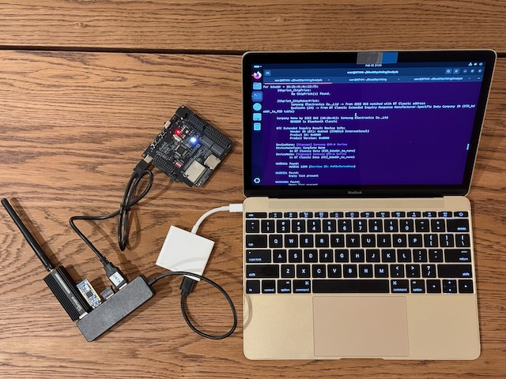

# Blue2thprinting - random **x86-based** laptop edition!

# Hardware needed

Note: the below hardware purchase links are Amazon affiliate links that support the [OpenSecurityTraining2](https://ost2.fyi) nonprofit.

---
**Required: x86-based laptop capable of running Ubuntu 24.04 Linux VM within VMware**

This has only been tested with x86 Macs, but in principle it should work regardless of the host OS, as you only need to pass the USB devices through to the Ubuntu VMware VMs.

The reason it needs to be x86-based, is because [Braktooth](https://github.com/Matheus-Garbelini/braktooth_esp32_bluetooth_classic_attacks) is only available as an x86 binary :-/. Everything except Braktooth works on other platforms. If you are OK without having the capability of sending LMP BT Classic packets, you can use an ARM-based platform.

---
**Required: custom packet sending hardware (for Braktooth/Sniffle)**

For [Braktooth](https://github.com/Matheus-Garbelini/braktooth_esp32_bluetooth_classic_attacks) - [ESP-WROVER-KIT](https://www.mouser.com/ProductDetail/Espressif-Systems/ESP-WROVER-KIT-VE?qs=KUoIvG%2F9Ilbci6DcltJYaA%3D%3D&mgh=1&gclid=EAIaIQobChMI1OOewJvugQMVik9HAR0FxgvkEAQYASABEgJ01PD_BwE) - ~\$40/unit

For [Sniffle](https://github.com/nccgroup/Sniffle) - 2x [Sonoff Zigbee 3.0 USB Dongle Plus-P](https://us.itead.cc/us/products/sonoff-zigbee-3-0-usb-dongle-plus?ref=366) - ~\$20/unit (**NOTE: Don’t buy the “Dongle-E” variants!** It must say “Dongle-P”.)

---
**Required: accessories**

* 1x - [USB BT dongle](https://amzn.to/45kyeGW) - ~$14/unit
 * Only needed if your VMware doesn't show a Bluetooth passthrough option.

* 1x - [Separate-power-optional USB-A hub](https://amzn.to/3VILnnj) - ~$17/unit
 * Only needed if there's not enough USB ports for everything you need to connect.

---
**Nice to have: general**

* 1x - [USB-A GPS receiver](https://amzn.to/44srqCJ) - ~$19/unit
* * Not necessary if you're only going to place sniffers at a single known location. Necessary if you're going to wander around and want to know where something was observed.

---

**If you bought everything correctly, your setup should look like this:**

---

# Supported base OS

* Install *Ubuntu 24.04* into a **VMware** VM.

Further configuration instructions will be given later.

Copyright(c) © Dark Mentor LLC 2023-2025
