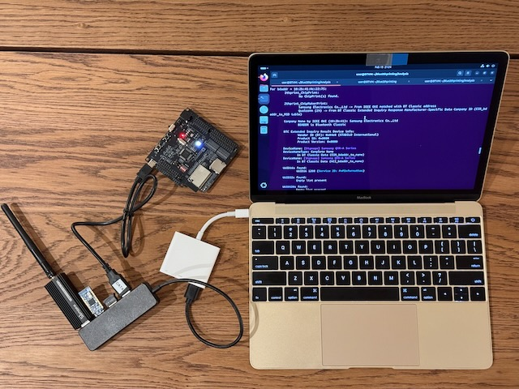

# Blue2thprinting - random **x86-based** laptop edition!

# Hardware needed

Note: the below hardware purchase links are Amazon affiliate links that support the [OpenSecurityTraining2](https://ost2.fyi) nonprofit.

---
**Required: laptop capable of running Ubuntu 24.04 Linux VM within VMware**

This has only been tested with x86 Macs, but in principle it should work regardless of the host OS or architecture, as you only need to pass the USB devices through to the Ubuntu VMware VMs.

---
**Required: custom packet sending hardware**

For LMP fingerprinting - any [supported Realtek USB BT dongle](https://github.com/darkmentorllc/Blue2thprinting) flashed with the bundled DarkFirmware_real_i firmware (the setup script auto-detects and flashes a compatible Realtek dongle if one is attached).

For [Sniffle](https://github.com/nccgroup/Sniffle) - 2x [Sonoff Zigbee 3.0 USB Dongle Plus-P](https://itead.cc/product/sonoff-zigbee-3-0-usb-dongle-plus/?ref=366) - ~\$20/unit (**NOTE: Don’t buy the “Dongle-E” variants!** It must say “Dongle-P” and have a TI CC2652P chip to work with Sniffle!)

---
**Required: accessories**

* 1x - [USB BT dongle](https://amzn.to/45kyeGW) - ~$14/unit
 * Only needed if your VMware doesn't show a Bluetooth passthrough option.

* 1x - [Separate-power-optional USB-A hub](https://amzn.to/3VILnnj) - ~$17/unit
 * Only needed if there's not enough USB ports for everything you need to connect.

---
**Nice to have: general**

* 1x - [USB-A GPS receiver](https://amzn.to/44srqCJ) - ~$19/unit
* * Not necessary if you're only going to place sniffers at a single known location. Necessary if you're going to wander around and want to know where something was observed.

---

**If you bought everything correctly, your setup should look like this:**

---

# Supported base OS

* Install *Ubuntu 24.04* into a **VMware** VM.

Further configuration instructions will be given later.

Copyright(c) © Dark Mentor LLC 2023-2026
