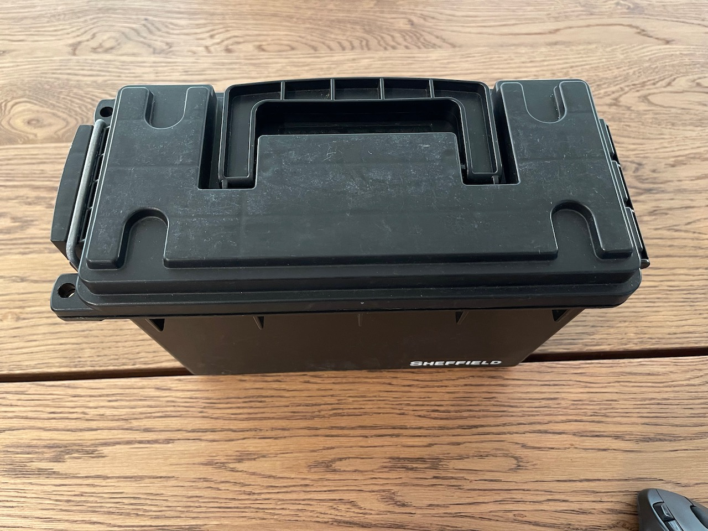

# Blue2thprinting Pro Max Extreme Edition!

Note: the below hardware purchase links are Amazon affiliate links that support the [OpenSecurityTraining2](https://ost2.fyi) nonprofit.

# Assumed Hardware
If you do not have any of the below, you will need to purchase.

* Keyboard
* Mouse
* Monitor with HDMI input (or DVI input and an HDMI adapter. Note: Raspberry Pis have not worked with all monitors / adapter configurations for me.)

# Hardware needed

Note: the below hardware purchase links are Amazon affiliate links that support the [OpenSecurityTraining2](https://ost2.fyi) nonprofit.

---
**Required: x86-based mini computer**

The reason it needs to be a x86-based platform, is because [Braktooth](https://github.com/Matheus-Garbelini/braktooth_esp32_bluetooth_classic_attacks) is only available as an x86 binary :-/. Everything except Braktooth works on other platforms. If you are OK without having the capability of sending LMP BT Classic packets, you can use an ARM-based platform.

A small form-factor x86-based PC (because currently Braktooth is only available as x86-64 Linux binaries.) You can use a laptop if you want, but I wanted to create a device I could place in a weather-proof container and lock up somewhere and sniff without fear of it being stolen, so this build is based around that assumed form factor.

* 1x - Up Squared (aka UP^2) [Intel Atom® x7-E3950 SKU](https://up-shop.org/default/up-squared-series.html) - \$289 + \$13.99 power supply + \$29.99 "M.2 2230 WiFi kit (RE-WFKIT-9260NVP)"
 * I used this because I had one laying around because it's a decent test platform if you're interested in using Positive Technologies' [Intel ME Exploit](https://github.com/XenoKovah/IntelTXE-PoC) (they're still selling permanently vulnerable boards! :D)
 * Note: Unfortunately this cannot run off a simple USB battery pack. You will need to buy a higher voltage (e.g. 12V) battery and a voltage converter to decrease to ~5.5V.

* 2x - [12V battery pack](https://amzn.to/3tqAj34) - ~\$40/unit

* 1x - [Voltage converter](https://amzn.to/3tkTew4) - ~\$14/unit

* 1x - [Plugs for voltage converter input](https://amzn.to/3RW5AoS) - ~\$4/unit

* 1x - [Plugs for voltage converter output](https://amzn.to/45wmFsu) - \$7/unit
* * You then need to wire it as 12V battery -> in-plugs -> converter -> out-plugs -> UP^2

---
**Required: custom packet sending hardware (for Braktooth/Sniffle)**

For [Braktooth](https://github.com/Matheus-Garbelini/braktooth_esp32_bluetooth_classic_attacks) - [ESP32-Ethernet-Kit-VE](https://amzn.to/44xxu07) - ~\$55/unit (This replaces the ESP-WROVER-KIT which is mentioned on the Braktooth page, which is no longer sold.)

For [Sniffle](https://github.com/nccgroup/Sniffle) - 2x [Sonoff Zigbee 3.0 USB Dongle Plus-P](https://itead.cc/product/sonoff-zigbee-3-0-usb-dongle-plus/?ref=366) - ~\$20/unit (**NOTE: Don’t buy the “Dongle-E” variants!** It must say “Dongle-P” and have a TI CC2652P chip to work with Sniffle!)

---
**Required: accessories**

* 1x - [Non-separate-power USB-A hub](https://amzn.to/3qHCkXw) - ~$8/unit
* * Necessary because there's not enough USB ports for everything you need to connect

* 1x - [HDMI-mini male to HDMI female adapter](https://amzn.to/44javCF) - ~$3.50/unit

* 1x - [USB-A GPS receiver](https://amzn.to/44srqCJ) - ~$19/unit
* * Not necessary if you're only going to place sniffers at a single known location. Necessary if you're going to wander around and want to know where something was observed.

---
**Nice to have: general**

* 1x - [5" Mini screen](https://amzn.to/3QtlJj1) - ~$39/unit
* * If you are using the device for mobile sniffing, it's desirable to know if it's actually continuing to capture data, or whether it's crashed. You won't be able to tell that without a screen

* 1x - [Short & flexible HDMI cable](https://www.amazon.com/gp/product/B0B5TDFVVW/ref=ppx_yo_dt_b_search_asin_title?ie=UTF8&th=1) for above mini-screen - ~$14/unit

* USB micro male to USB A male cable (to power the mini-screen) -

---
**Nice to have: Outdoor deployment equipment**

The following are only required if you'll be placing the devices into an outdoor environment for days at a time:

* 1x - [Lockable water-proof outdoor box](https://amzn.to/3OHsSeO) - ~$9/unit

* 1x - [Keyed Padlock](https://amzn.to/3P95PuM) - ~$10/unit

* 1x - [Flexible bike lock](https://amzn.to/3YOu7xf) - ~$9/unit
* * These [aren't particularly secure](https://www.youtube.com/shorts/dA9OsRal_L8), and indeed I forgot my combo at one point and had to pick my own. But they're just there to stop hobos and randos from walking off with your stuff ;).

---

# Physical hardware setup

**If you bought & set up everything correctly, your setup should look like this**

* Note: This is without the GPS USB connected (for deployment in a fixed location).
* 1 = "UP^2" above
* 2 = "M.2 2230 WiFi kit" above
* 3 = "12V battery pack" above (note, it actually comes with that splitter, for charging and using at the same time, but I use the splitter to connect 2 batteries at once for longer runtime.)
* 4 = "Plugs for voltage converter input" above
* 5 = "Voltage converter" above
* 6 = "Plugs for voltage converter output" above
* 7 = "Non-separate-power USB-A hub" above
* 8 = "nRF52840 USB dongle" above
* 9 = "ESP-WROVER-KIT" above (with USB micro male to USB A male cable (needs data transport))
* 10 = "5" Mini screen" above
* 11 = "Short & flexible HDMI cable" above
* 12 = "USB micro male to USB A male cable" (only needs power transport) above
* 13 = "Lockable water-proof outdoor box" above

**Example of how I install the equipment in the box:**

⬆️ Step 1: I put some foam in to padd some components:

⬆️ Step 2: I place the UP^2 to one side, with the heat-sink facing outward, and one antenna oriented vertically and one horizontally (superstition!) Note, the metal on the antennas is wrapped in tape to avoid it touching any other component's pins.

⬆️ Step 3: I connect the USB hub to the UP^2. The USB hub has the Nordic USB dongle and wireless mouse dongle plugged in, as well as the ESP-WROVER-KIT data cable. I place the ESP-WROVER-KIT at the opposite side of the box, wrapped in something non-conductive (e.g. bubble wrap in this case), so that its exposed pins don't touch any other components.

⬆️ Step 4: I connect the keyboard USB cable to the USB hub. And I insert the two 12V batteries, connected via their included splitter. I place the batteries so that there is a gap inbetween them, where the screen will be slotted when not in use later.

⬆️ Step 5: I connect the 5" screen via HDMI and USB. The screen has a switch to power it off when not in use, which should be flipped to save battery life.

⬆️ Step 6: I connect the assembled 12V -> 5.5V power converter, connecting one end to the 12V batteries' splitter, and one end to the power of the UP^2.

⬆️ Step 7: At this point the USB keyboard cord can be coiled in the box, and the box powered on, for portable sniffing or placement at a location for static sniffing.

⬆️ Step 8: The box can then be opened and the keyboard connected and powered on, the mouse powered on, and screen removed and powered on and it can be interacted with like any other Linux-based PC. The power converted can be disconnected from the splitter connected to the 12V batteries, and a charger connected instead, to charge the 12V batteries once they're dead. Or the device can simply be connected to the UP^2's wall power adapter when experimenting and not needing to run off battery.

* Note: In principle it's desirable to use a wired mouse/keyboard, *not* wireless ones, to not introduce any additional 2.4GHz interference. On the other hand, I find that using a normal wired mouse is inconvenient if I'm driving around and want to look at something, because there's no decent mousing surfaces. Hence why I use a wireless trackball. (I should probably get a wired trackball.)

---

# Supported base OS

* Install *Ubuntu 24.04* into host OS.

Further configuration instructions will be given later.

Copyright(c) © Dark Mentor LLC 2023-2025
