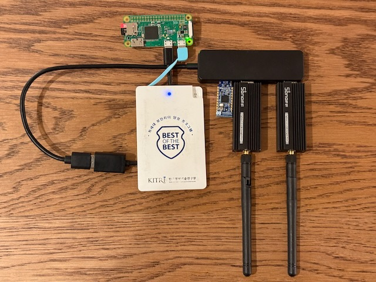
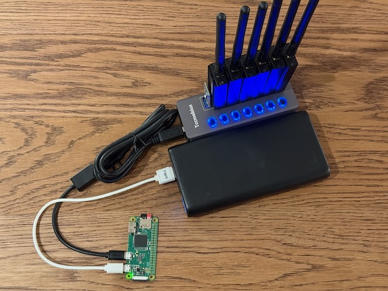
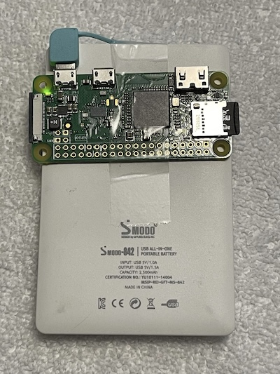

# tiny2th

Note: the below hardware purchase links are Amazon affiliate links that support the [OpenSecurityTraining2](https://ost2.fyi) nonprofit.

# WHAT THIS DOESN'T SUPPORT

[Braktooth](https://github.com/Matheus-Garbelini/braktooth_esp32_bluetooth_classic_attacks) is only available as an x86 binary, therefore **this setup cannot be used for BT Classic custom traffic sending.** For that you will need to upgrade to [a x86-based laptop](./laptopHW.md) or [a x86-based mini-PC](./maxHW.md).

# Assumed Hardware
If you do not have any of the below, you will need to purchase.

* Keyboard  
* Mouse  
* Monitor with HDMI input (or DVI input and an HDMI adapter. Note: Raspberry Pis have not worked with all monitors / adapter configurations for me.)  
* USB-micro male to USB-A male cable (to be used for power)  

# Recommended Hardware

The below recommends 2 of some things, just because it ends up being cheaper per-unit. Or because it's useful to have an extra if one dies. 

For devices where only 1 is recommended, it is assumed that you will only have one Raspberry Pi powered up at a time. If you intend to have both powered, you will need to increase to 2x.

---
**Required: Raspberry Pi Zero W (and basic adapters)**

* 2x - [Raspberry Pi Zero W](https://www.raspberrypi.com/products/raspberry-pi-zero/) - ~$10/unit
 * You can use a Raspberry Pi 4b if you already have one, but in my experiments they capture less data than the Pi Zero W.

* 2x - [64 GB micro SD card](https://amzn.to/3PahwSb) - ~$6/unit
 * If you don't have a way to mount microSD cards, will also require 1x [SD card to USB adapter](https://amzn.to/3KURtM1) - ~$7/unit

* 2x - [USB-micro male to USB-A female adapter](https://amzn.to/45Ip6bN) - ~$4/unit
 * The USB hub is plugged into this.

* 2x - [USB-A battery pack (38800mAh)](https://amzn.to/3YPa5mD) - ~$32/unit
 * You can use a [smaller & cheaper battery](https://amzn.to/4hGavUI) (~$17/unit, as long as it can power USB micro) if you don't need to leave the device unattended for days.

* 1x - [Non-separate-power USB-A hub](https://amzn.to/3qHCkXw) - ~$8/unit
 * *Note:* in my experience connecting an unpowered USB-A hub to the Pi Zero seems to cause too much of a power draw, and causes it to reboot. For this reason, while at home you may want to instead use a [powered USB hub](https://amzn.to/3YJU3u5) (even though it's more expensive.) However, the unpowered USB-A hub is necessary if you want to bring keyboard and mouse and GPS with you while driving around (e.g. if you think you may want to check on the status.)

* 1x - [HDMI-mini male to HDMI femle adapter](https://amzn.to/44javCF) - ~$3.50/unit

* 1x - [USB-A Ethernet Adapter](https://amzn.to/3qOezgr) - ~$10/unit
 * The Pi does not have a real time clock battery. Therefore if you power it off and power it on a week later, it will still think it's the previous time. I've been too lazy to wire up a battery, and instead I just use NTP to sync the time over the network whenever I power it on before a sniffing run. Also, I use Ethernet, because I disable the WiFi so that it doesn't waste power or compete with the Bluetooth for the antenna via "coexistence".

---
**Required: custom packet sending hardware (for Sniffle)**

* For [Sniffle](https://github.com/nccgroup/Sniffle) - 2x+ - [Sonoff Zigbee 3.0 USB Dongle Plus-P](https://us.itead.cc/us/products/sonoff-zigbee-3-0-usb-dongle-plus?ref=366) - ~\$20/unit (**NOTE: Don’t buy the “Dongle-E” variants!** It must say “Dongle-P”.) For capturing pcap of BLE traffic and/or sending custom BLE packets.
 * The code will currently automatically scale to however many Sniffle dongles you plug in, capturing backup pcaps across channels to catch packets which might be missed otherwise (e.g. due to wireless interference/decoding issues.)

---
**Nice to have: general**

* 1x - [5" Mini screen](https://amzn.to/3QtlJj1) - ~$39/unit
 * If you are using the device for mobile sniffing, it's desirable to know if it's actually continuing to capture data, or whether it's crashed. You won't be able to tell that without a screen + the unpowered USB hub + keyboard + mouse.

* 1x - [Short & flexible HDMI cable](https://www.amazon.com/gp/product/B0B5TDFVVW/ref=ppx_yo_dt_b_search_asin_title?ie=UTF8&th=1) for above mini-screen - ~$14/unit

* 1x - [USB-A GPS receiver](https://amzn.to/44srqCJ) - ~$19/unit
 * Not necessary if you're only going to place sniffers at a single known location. Necessary if you're going to wander around and want to know where something was observed.

* You will need an additional USB micro male to USB A male cable (to be used for power for the mini-screen).

---
**Nice to have: Outdoor deployment equipment**

The following are only required if you'll be placing the devices into an outdoor environment for days at a time:

* 2x - [Lockable water-proof outdoor box](https://amzn.to/3OHsSeO) - ~$9/unit

* 2x - [Keyed Padlock](https://amzn.to/3P95PuM) - ~$10/unit

* 2x - [Flexible bike lock](https://amzn.to/3YOu7xf) - ~$9/unit
 * These [aren't particularly secure](https://www.youtube.com/shorts/dA9OsRal_L8), and indeed I forgot my combo at one point and had to pick my own. But they're just there to stop hobos and randos from walking off with your stuff ;).

**If you bought everything correctly, your setup should look like this:**

(Oh hey, it's my [BoB](https://en.kitribob.kr/) USB battery pack from when I gave a talk in 2015, which still works!)

Or if you decide to add more Sonoff dongles...

Or, if you decide to optimize for size rather than capabilities...

# Supported base OS

* Raspberry Pi Zero W: Install Raspbian ***Buster*** using the [Raspberry Pi Imager](https://www.raspberrypi.com/software/).

Further configuration instructions will be given later.

Copyright(c) © Dark Mentor LLC 2023-2025
